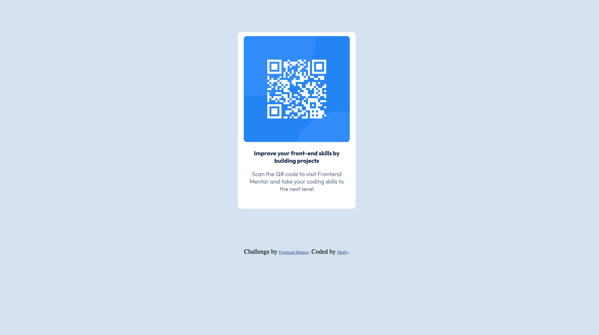

# Frontend Mentor - QR code component solution

This is a solution to the [QR code component challenge on Frontend Mentor](https://www.frontendmentor.io/challenges/qr-code-component-iux_sIO_H). Frontend Mentor challenges help you improve your coding skills by building realistic projects.

## Table of contents

- [Overview](#overview)
  - [Screenshot](#screenshot)
  - [Links](#links)
- [My process](#my-process)
  - [Built with](#built-with)
  - [What I learned](#what-i-learned)
  - [Continued development](#continued-development)

## Overview

### Screenshot

### Links

- Solution URL: [Add solution URL here](https://github.com/mollyollyoxenfree/QR-Challange)
- Live Site URL: [Add live site URL here](https://mollyollyoxenfree.github.io/QR-Challange/)

## My process

### Built with

- HTML
- CSS

### What I learned

This was my first coding challenge. I just started taking a web development course through udemy. We just finished learning the basics of html and CSS.  So far, it's been a good experience. Frustrating at times. I have a long way to go. This challenge was harder than I expected. I'd appreciate feedback on how I could improve my code or organize things differenly.

### Continued development

I would like to get more comfortable with sizing and positioning elements.
